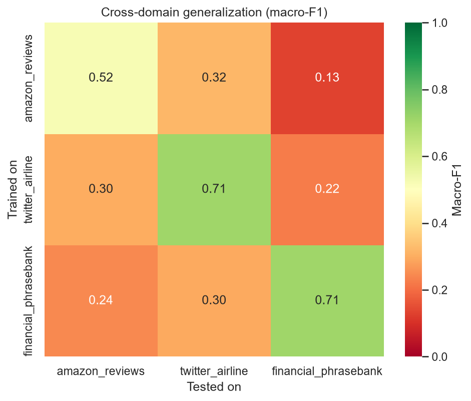
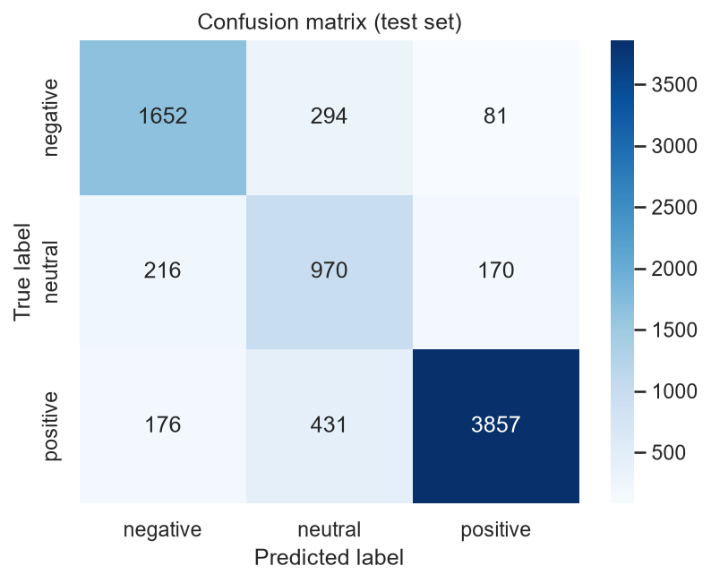
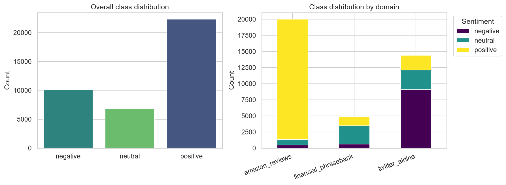

# Cross-Domain Sentiment Analysis

**CodeAlpha Data Analytics Internship — Task 4: Sentiment Analysis**

A sentiment classification system trained and evaluated across **three
distinct text domains** — product reviews, social media, and financial
news — built to answer a question most sentiment-analysis projects don't
ask: *does a model that works on one kind of text actually generalize to
another?*

Rather than training on a single dataset, this project deliberately
combines **Amazon product reviews**, **Twitter airline sentiment**, and
**Financial PhraseBank** news sentences, then measures cross-domain
generalization directly with a train-on-one/test-on-another evaluation
matrix. See [`docs/methodology.md`](docs/methodology.md) for the full
reasoning behind every design decision.

---

## Tech Stack

- Python
- Pandas
- NumPy
- Scikit-learn
- NLTK
- Matplotlib
- Seaborn
- Jupyter Notebook
- Git/GitHub

---

## Table of contents

- [Tech Stack](#tech-stack)
- [Why three domains](#why-three-domains)
- [Project structure](#project-structure)
- [Datasets](#datasets)
- [Setup](#setup)
- [Usage](#usage)
- [Methodology summary](#methodology-summary)
- [Results](#results)
- [Testing](#testing)
- [Limitations & next steps](#limitations--next-steps)
- [License](#license)

---

## Why three domains

Most sentiment-analysis portfolio projects train and test on a single
dataset (usually IMDB reviews or one Twitter set), which never actually
tests whether the model learned "sentiment" or just the surface patterns
of one narrow style of text. This project instead:

1. Trains on **reviews, social media, and news** — matching the full
   scope of the task brief instead of the easiest interpretation of it.
2. Runs a **cross-domain generalization matrix**: train on domain A,
   test on domain B, for every pair. The diagonal is the in-domain
   baseline; the off-diagonal cells show exactly how much accuracy is
   lost when a model sees an unfamiliar style of text.
3. Compares that against a **single model trained on all three domains
   pooled together**, to test whether multi-domain training recovers the
   generalization gap or whether domain-specific patterns dilute each
   other.
4. Forces the model to handle the **neutral class properly** — the
   hardest class in sentiment analysis, and the one most beginner
   projects skip by only doing positive/negative.

---

## Project structure

```
codealpha_sentiment_analysis/
│
├── data/
│   ├── raw/
│   │   ├── amazon_reviews/          # amazon_reviews.csv
│   │   ├── twitter_airline/         # twitter_airline_sentiment.csv
│   │   └── financial_phrasebank/    # financial_phrasebank.csv
│   ├── processed/                   # Unified, cleaned dataset (generated)
│   └── external/
│
├── notebooks/
│   ├── 01_eda.ipynb                 # Exploratory data analysis
│   └── 02_model_experiments.ipynb   # Model training & comparison scratchpad
│
├── src/
│   ├── config.py                    # All paths, hyperparameters, constants
│   ├── data_loader.py               # Loads & unifies all three domains
│   ├── data_cleaning.py             # Standalone cleaning utility (separate schema)
│   ├── preprocessing.py             # Text cleaning, tokenization, lemmatization
│   ├── feature_engineering.py       # TF-IDF vectorization, train/test split
│   ├── visualization.py             # All report figures
│   ├── train.py                     # Trains & selects best model
│   ├── evaluate.py                  # Metrics, confusion matrix, per-domain scores
│   ├── cross_domain_eval.py         # The train-on-A/test-on-B analysis
│   ├── predict.py                   # Inference CLI (single text / batch CSV)
│   └── utils.py                     # Logging, pickle/JSON helpers
│
├── models/                          # Trained model + vectorizer
├── outputs/
│   ├── figures/                     # All plots
│   ├── reports/                     # Written summary reports
│   └── metrics/                     # metrics.json, cross_domain_metrics.json
│
├── docs/
│   ├── methodology.md               # Design decisions & reasoning
│   └── dataset_description.md       # Dataset sources, schemas, licensing
│
├── tests/
│   ├── test_preprocessing.py
│   └── test_feature_engineering.py
│
├── requirements.txt
├── README.md
├── LICENSE
├── .gitignore
└── main.py                          # Runs the full pipeline end-to-end
```

---

## Datasets

| Domain | Dataset | Rows loaded | Labels |
|---|---|---|---|
| Reviews | Amazon Product Reviews | 20,000 (sampled) | Star rating → mapped to 3 classes |
| Social media | Twitter US Airline Sentiment | 14,640 | Native 3-class |
| News | Financial PhraseBank | 4,846 | Native 3-class, expert-labeled |

Combined: **39,265 rows** across all three domains (39,234 after removing
rows that became empty during text cleaning).

Full sources, expected file formats, and licensing notes are in
[`docs/dataset_description.md`](docs/dataset_description.md). Raw data
files are not committed to this repo — download them and place them in
`data/raw/<domain>/` using the filenames referenced there.

---

## Setup

```bash
git clone https://github.com/Bem132833/codealpha_sentiment_analysis.git
cd codealpha_sentiment_analysis

python -m venv venv
source venv/bin/activate      # Windows: venv\Scripts\activate

pip install -r requirements.txt

python -m src.preprocessing --download-nltk
```

Then download the three datasets (see `docs/dataset_description.md`) and
place them at:
```
data/raw/amazon_reviews/amazon_reviews.csv
data/raw/twitter_airline/twitter_airline_sentiment.csv
data/raw/financial_phrasebank/financial_phrasebank.csv
```

---

## Usage

### Run the full pipeline

```bash
python main.py
```

Loads and unifies all three datasets, preprocesses the text, builds
TF-IDF features, trains and selects the best model, evaluates it
(overall + per-domain), runs the cross-domain generalization analysis,
and generates every figure.

### Predict sentiment for new text

```bash
python -m src.predict --text "the flight was delayed and staff were rude"
python -m src.predict --csv path/to/new_texts.csv --text-col review
python -m src.predict
```

### Explore in Jupyter

```bash
jupyter notebook notebooks/01_eda.ipynb
jupyter notebook notebooks/02_model_experiments.ipynb
```

---

## Methodology summary

- **Preprocessing:** lowercasing, URL/mention/HTML stripping, hashtag
  normalization, stopword removal, and lemmatization via NLTK.
- **Features:** TF-IDF (unigrams + bigrams, 15,000-term vocabulary) —
  chosen over embeddings for interpretability, speed, and reproducibility.
- **Models:** Logistic Regression and Linear SVM, trained on identical
  features and compared by **macro-F1**, since the neutral class is
  underrepresented and accuracy alone would reward ignoring it. Both use
  `class_weight="balanced"`.
- **Evaluation:** overall accuracy/macro-F1, full classification report,
  confusion matrix, per-domain breakdown, and the cross-domain
  generalization matrix.

Full reasoning for every choice is in
[`docs/methodology.md`](docs/methodology.md).

---

## Results

Results from a full run on the real datasets (20,000 sampled Amazon
reviews, 14,640 tweets, 4,846 financial sentences — 39,234 rows after
cleaning). Re-run `python main.py` any time to regenerate all of this.

**Best model:** Logistic Regression (macro-F1 = 0.7825), narrowly ahead
of Linear SVM (macro-F1 = 0.7756)

**Overall performance (test set, all domains combined, n = 7,847):**

| Metric | Score |
|---|---|
| Accuracy | 0.8257 |
| Macro-F1 | 0.7825 |

| Class | Precision | Recall | F1 | Support |
|---|---|---|---|---|
| Negative | 0.81 | 0.81 | 0.81 | 2,027 |
| Neutral | 0.57 | 0.72 | 0.64 | 1,356 |
| Positive | 0.94 | 0.86 | 0.90 | 4,464 |

As expected, **neutral is the hardest class** by a wide margin — its F1
(0.64) trails negative (0.81) and positive (0.90) substantially, which
is exactly the failure mode simpler positive/negative-only projects
never have to confront.

**Per-domain performance (combined model):**

| Domain | n (test) | Accuracy | Macro-F1 |
|---|---|---|---|
| Amazon reviews | 4,012 | 0.9100 | 0.4961 |
| Twitter airline | 2,856 | 0.7507 | 0.6639 |
| Financial PhraseBank | 979 | 0.6987 | 0.5623 |

Note the gap between accuracy and macro-F1 on Amazon reviews (0.91 vs
0.50) — accuracy alone looks excellent, but that's mostly the model
correctly spotting the dominant positive class while struggling on
Amazon's underrepresented neutral/negative reviews. This is exactly the
distortion macro-F1 is meant to expose.

**Cross-domain generalization matrix (macro-F1):**



| Trained on \ Tested on | Amazon | Twitter | Financial |
|---|---|---|---|
| **Amazon** | 0.5210 (in-domain) | 0.2988 | 0.2428 |
| **Twitter** | 0.3189 | 0.7071 (in-domain) | 0.2962 |
| **Financial** | 0.1314 | 0.2234 | 0.7078 (in-domain) |
| **Combined (all 3)** | 0.5113 | 0.6545 | 0.5889 |

The diagonal (in-domain) scores — 0.52 / 0.71 / 0.71 — are consistently
and substantially higher than every off-diagonal (cross-domain) score,
which bottoms out at **0.13** (a model trained only on formal financial
text collapses almost completely on Amazon reviews). This confirms the
project's starting hypothesis: sentiment models are domain-brittle, and
a model that looks strong on one kind of text cannot be assumed to work
on another. The **combined, all-domains model largely closes this gap**
— it scores 0.65 on Twitter and 0.59 on Financial PhraseBank, close to
or above most single-domain cross-transfer scores, while still holding
0.51 macro-F1 on Amazon reviews (versus 0.52 in-domain). Pooling all
three domains during training acts as a mild regularizer that trades a
small amount of in-domain accuracy for a large gain in cross-domain
robustness — a genuinely useful, reportable finding rather than an
assumed one.

**Confusion matrix:**



The confusion matrix confirms the neutral class is where most errors
concentrate — neutral examples are most often confused with negative,
suggesting the model tends to read mild criticism or hedged language as
negative rather than neutral, likely inherited from Amazon's 3-star →
neutral mapping being a noisier signal than the natively-labeled
Twitter/financial neutral examples.

**Class distribution:**



---

## Testing

```bash
pytest tests/ -v
```

Covers text cleaning/normalization edge cases (URLs, mentions, HTML,
empty input) and the feature engineering pipeline (stratified splitting,
TF-IDF vocabulary construction, label encoding round-trips).

---

## Limitations & next steps

- TF-IDF cannot reliably capture negation scope or sarcasm ("not bad at
  all" is a known failure mode for bag-of-n-grams models). A fine-tuned
  transformer (e.g. DistilBERT) would likely close some of this gap at
  the cost of training time and interpretability.
- The Amazon 3-star → neutral mapping is a simplification; 3-star
  reviews are sometimes mildly positive or negative rather than
  genuinely neutral.
- `src/data_cleaning.py` is a standalone utility for cleaning a
  differently-schemed reviews dataset (`Review Text`/`Rating` columns)
  and is not part of the main `main.py` pipeline.
- Full caveats and reasoning are documented in
  [`docs/methodology.md`](docs/methodology.md#9-limitations-and-honest-caveats).

---

## License

MIT — see [LICENSE](LICENSE).

---

**Author:** Bemigbar Yehuwalawork ([@Bem132833](https://github.com/Bem132833)) — Software Engineering student, AASTU
Built as part of the CodeAlpha Data Analytics Internship, July 2026.